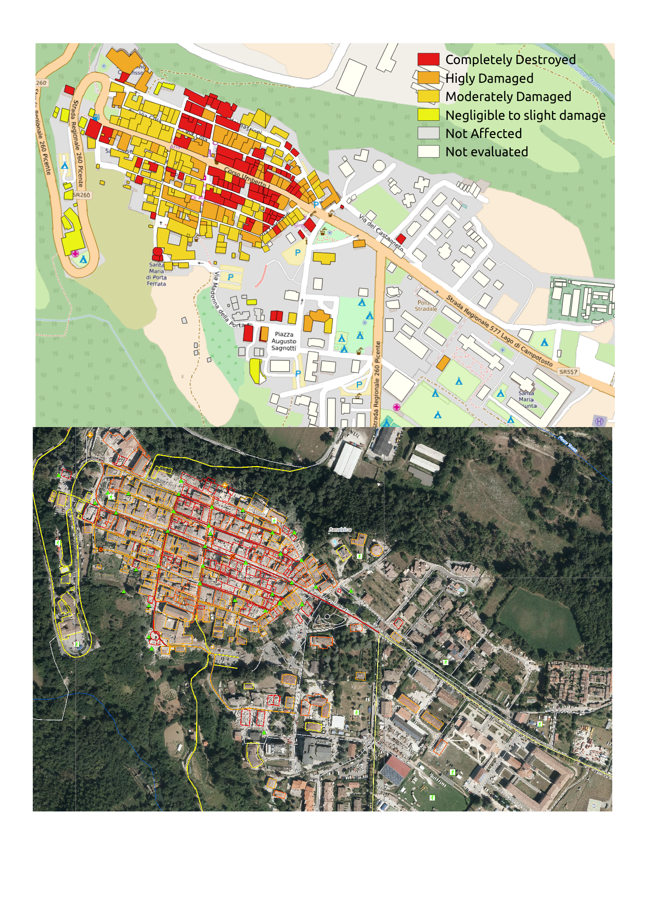

# Informazioni sull'elaborazione dei dati

Lo shapefile settlements_merged è stato derivato da [Alessandro Sarretta](https://twitter.com/alesarrett) da dai dati pubblicati da Copernicus Emergency Management Service (© 2016 European Union) nella sezione [[EMRS177] Earthquake in Central Italy](http://emergency.copernicus.eu/EMSR177). Lo scopo principale è di rendere disponibile nel modo più aperto ed immediato possibile le informazioni relative alla valutazione del danno del terremoto, e di favorire l'inserimento di tali informazioni in Openstreetmap.

Con questa visione, e in conformità alla [policy di Copernicus EMS](http://emergency.copernicus.eu/mapping/ems/cite-copernicus-ems-mapping-portal), che dichiara che "_the information produced by the Copernicus Emergency Management Service shall be made available to the public on a full, open and free-of-charge basis_", i dati contenuti nello shapefile settlements_merged e tutti i suoi derivati (kml, geojson, ...) sono rilasciati con licenza [Creative Commons Attribution-ShareAlike 4.0 International](http://creativecommons.org/licenses/by-sa/4.0/) (CC-BY-SA).

In particolare, sono stati scaricati i dati vettoriali relativi alla valutazione del danno per le 26 mappe prodotte. Nel file [mapsList.csv](./mapsList.csv) si trovano elencati i nomi delle mappe con i link al download diretto del file zip contentente ciascuno shapefile.

Come si può notare dall'immagine rappresentante l'estensione delle aree valutate da Copernicus EMS, le mappe nel cui nome è incluso "aerial" sono state fatte da voli in corrispondenza di aree ristrette (centri abitati) e quindi sono comprese in altre mappe a scala minore.

I file contengono valutazioni dei danni per vari elementi, tra cui edifici, strade, ferrovie, e anche informazioni puntuali su crolli, strade interrotte e sulla localizzazione di campi di soccorso e tende. Nel file settlements_merged sono inclusi solamente i dati relativi alla valutazione dei danni sugli edifici.

I file vettoriali sono stati elaborati in [QGIS](http://qgis.org) e uniti in un singolo shapefile tramite il comando "Merge vector layers".

Sono stati creati 2 file di stile, uno per visualizzare i dati tematizzati in QGIS ([_settlements_merged.qml_]() e uno in formato standard OGC [Style Layer Descriptor](http://www.opengeospatial.org/standards/sld) ([_settlements_merged.sld_].

Tutti i file sono nel sistema di coordinate WGS 84 / UTM zone 33 N ([EPSG:32633](http://spatialreference.org/ref/epsg/32633/)), tranne 2: 
_Accumoli Aerial: Grading Map_ e _Sant'Angelo Aerial: Grading Map_
Poiché davano dei problemi nell'operazione di merge e le valutazione sono incluse da altre mappe a scala minore, per ora non sono stati inclusi.

Infine, il file è stato reso disponibile da Openstreetmap Italia tramite sevizio standard WMS a [questo link](http://osmit3.wmflabs.org/cgi-bin/qgis_mapserv.fcgi?map=/srv/Copernicus/settlements_grading.qgs&SERVICE=WMS&REQUEST=GetCapabilities&VERSION=1.3), per poter essere utilizzato ad esempio in [questo task di mappatura di Openstreetmap](http://osmit-tm.wmflabs.org/project/15).

Nella figura qui sotto un'immagine di esempio con in alto la zona di Amatrice con sfondo Openstreetmap e sovrapposto il WMS con lo shapefile settlements_merged, in basso la stessa zona nella mappa di Copernicus EMS.

## Note

Incongruenze trovate tra alcune mappe e i corrispondenti vettoriali, comunicate a Copernicus EMS via Twitter:

* [Arquata del Tronto Aerial: Grading Map](http://emergency.copernicus.eu/mapping/ems-product-component/EMSR177_19ARQUATADELTRONTOAERIAL_GRADING_OVERVIEW/2) has many damaged building but shapefile has empty grading field
* the shapefile of settlements of [Sant'Angelo Aerial: Grading Map](http://emergency.copernicus.eu/mapping/ems-product-component/EMSR177_26SANTANGELOAERIAL_GRADING_OVERVIEW/1) has wrong dbf fields so grading is null
* is it correct that [Amatrice East: Grading Map, Monitoring 1]((http://emergency.copernicus.eu/mapping/ems-product-component/EMSR177_11AMATRICEEAST_GRADING_OVERVIEW-MONIT01/1) is more recent that 2 or is an error?
