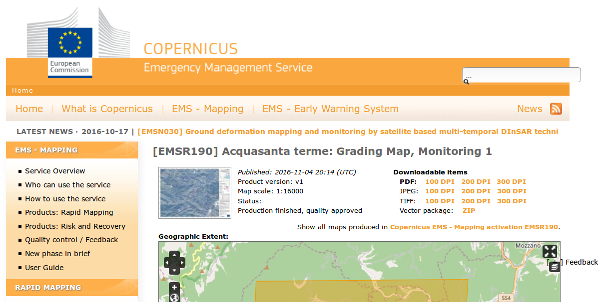
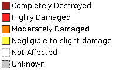

# Dati vettoriali aggregati da Copernicus EMSR190: Earthquake in Central Italy

Questo documento contiene informazioni relative a dati vettoriali aggregati a partire dal servizio [Copernicus Emergency Management Service](http://emergency.copernicus.eu).

In particolare i dati sono relativi all'attivazione [_"EMSR190: Earthquake in Central Italy"_](http://emergency.copernicus.eu/EMSR190).

## CopernicusEMS

Il team di CopernicusEMS utilizza dati vettoriali e immagini aeree per effettuare delle valutazioni sugli effetti del terremoto su edifici, strade e altre infrastrutture. Per ogni area indagata, vengono create delle mappe, aggiornate periodicamente, rese disponibili per il download in vari formati (PDF, JPEG, TIFF), nonché dei file vettoriali, in formato shapefile, scaricabili in un file compresso.

Di questa ingente mole di dati non esiste un livello aggregato per tutta l'area di analisi, né esistono dei servizi standard OGC per rendere disponibili tali prodotti sul web in modo accessibile ed interoperabile.

## Aggregazione dei dati vettoriali

La comunità di [Openstreetmap](http://openstreetmap.org) si è attivata in vari modi per rendere disponibili ed integrare in Openstreetmap questi dati così importanti per la valutazione dei danni causati dal sisma.

Qui in particolare si descrive l'attività di aggregazione e di messa a disposizione dei dati relativi alla classificazione (così come effettuata da Copernicus EMS) dei danni subiti dagli edifici in seguito al terremoto.

Paolo Frizzera ([@geofrizz](https://github.com/geofrizz)) ha creato uno [script in python](https://github.com/emergenzeHack/terremotocentro_geodata/tree/gh-pages/CopernicusEMS/scripts) per decomprimere e unire (_merge_) tutti i file scaricati da Copernicus in un unico file.

Gli output di quest'operazione possono essere visualizzati ai seguenti links:
* http://osmit3.wmflabs.org/check/sisma_Macerata_2016/ (per il terremoto di Ottobre 2016, corrispondente all'attivazione [CopernicusEMS 177](http://emergency.copernicus.eu/EMSR177))
* http://osmit3.wmflabs.org/check/sisma_Rieti_2016/ (per il terremoto di Agosto 2016, corrispondente all'attivazione [CopernicusEMS 190](http://emergency.copernicus.eu/EMSR190)))

In ciascuna cartella sono presenti tre files:
* un csv con il nome del comune e il numero di edifici danneggiati raggruppati per tipologia di danneggiamento;
* un geojson con i dati relativi al tag earthquake:damage:*
* ed infine un html che visualizza i dati geojson su una mappa.

Questi files si aggiornano giornalmente.

Esiste anche un **servizio WMS** che è possibile utilizzare in software desktop GIS (ad es. [QGIS](http://qgis.org)), in portali web o come layer aggiuntivo per integrare le informazioni in Openstreetmap.

Qui l'URL del WMS: http://osmit3.wmflabs.org/cgi-bin/qgis_mapserv.fcgi?map=/srv/Copernicus/EMSR190/settlements_grading.qgs&SERVICE=WMS&REQUEST=GetCapabilities&VERSION=1.3

La valutazione è stata effettuata secondo le seguenti classi:

All'interno della cartella [*vector_data*](./vector_data/) sono anche contenuti dei file di stile utilizzabili in QGIS (*settlements_poly_grading.qml*) e in servizi WMS (*settlements_poly_grading.sld*).

## Data policy Copernicus EMS

I dati originali sono pubblicati da Copernicus EMS e quindi per utilizzo e citazioni si deve fare riferimento alle informazioni contenute nel sito, in particolare :

Under Copernicus and Commission Delegated Regulations [Regulation (EU) No 377/2014 and commission Delegated Regulation (EU) No 1159/2013] the information produced by the Copernicus Emergency Management Service shall be made available to the public on a full, open and free-of-charge basis. However, under exceptional circumstances, dissemination restrictions may be imposed for security reasons or for the protection of third party rights. See also detailed Copernicus EMS Data and Dissemination Policy. For more information: http://emergency.copernicus.eu/mapping/ems/cite-copernicus-ems-mapping-portal

The resource has to be cited as follows: "Copernicus Emergency Management Service (© 2016 European Union), EMSR190 Earthquake in Central Italy (http://emergency.copernicus.eu/EMSR190)"

## Automatizzazione del download dei dati

Attualmente i file vengono scaricati manualmente dal sito di Copernicus, inseriti nelle cartelle corrette, e poi viene fatto girare lo script di aggregazione.

Idealmente si potrebbe semplificare anche questa fase, attraverso l'automatizzazione del download dei dati.

Il notebook	[EMSR190_scraping.ipynb](CopernicusEMS_autoDownMerge.ipynb) è stato creato a questo scopo, ma non ancora finalizzato.

Il suggerimento di [@aborruso](https://github.com/aborruso) suggerito nell'[issue 4](https://github.com/emergenzeHack/terremotocentro_geodata/issues/4) permette di risolvere la questione, ma non è stato ancora integrato.
