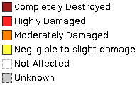

# Dati vettoriali aggregati da Copernicus EMSR190: Earthquake in Central Italy

Questa cartella contiene dati vettoriali aggregati a partire dal servizio Copernicus Emergency Management Service.

In particolare i dati sono relativi all'attivazione _"
EMSR190: Earthquake in Central Italy"_ ().

Nella cartella *vector_data* è attualmente contenuto un solo  layer vettoriale in formato shapefile (*settlements_poly_grading_merged.shp*) che rappresenta la classificazione (così come effettuata da Copernicus EMS) dei danni subiti dagli edifici in seguito al terremoto di Ottobre 2016 in centro Italia.

La valutazione è stata effettuata secondo le seguenti classi:

Il layer *settlements_poly_grading_merged.shp* è stato aggregato (operazione *merge* effettuata in ambiente QGIS 2.16) a partire dai seguenti layers, tutti scaricati dalla pagina http://emergency.copernicus.eu/EMSR190:

* EMSR190_01APPENNINO_02GRADING_v1_12500_settlements_poly_grading.shp
* EMSR190_02USSITA_02GRADING_MONIT02_v1_12500_settlements_poly_grading.shp
* EMSR190_03PINTURA_02GRADING_v1_12500_settlements_poly_grading.shp
* EMSR190_04PRECI_02GRADING_MONIT02_v1_12500_settlements_poly_grading.shp
* EMSR190_05VISSO_02GRADING_MONIT01_v1_12500_settlements_poly_grading.shp
* EMSR190_06FOCE_02GRADING_v1_12500_settlements_poly_grading.shp
* EMSR190_07TODIANO_02GRADING_MONIT02_v1_12500_settlements_poly_grading.shp
* EMSR190_08PIEDELCOLLE_02GRADING_MONIT01_v1_12500_settlements_poly_grading.shp
* EMSR190_09CASTELLUCCIO_02GRADING_MONIT01_v1_12500_settlements_poly_grading.shp
* EMSR190_10NORCIA_02GRADING_MONIT01_v2_12500_settlements_poly_grading.shp
* EMSR190_11GROTTI_02GRADING_MONIT01_v1_12500_settlements_poly_grading.shp
* EMSR190_12ARQUATA_02GRADING_v1_13000_settlements_poly_grading.shp
* EMSR190_13AMANDOLA_02GRADING_v1_12500_settlements_poly_grading.shp
* EMSR190_14MONTEMONACO_02GRADING_v2_12500_settlements_poly_grading.shp
* EMSR190_15MONTEGALLO_02GRADING_v2_12500_settlements_poly_grading.shp
* EMSR190_16CAMERINO_02GRADING_v1_10000_settlements_poly_grading.shp
* EMSR190_17MUCCIA_02GRADING_v1_12000_settlements_poly_grading.shp
* EMSR190_18SANLORENZOALLAGO_02GRADING_v1_10000_settlements_poly_grading.shp
* EMSR190_19BELFORTEDELCHIENTI_02GRADING_v1_12000_settlements_poly_grading.shp
* EMSR190_20COLMURANO_02GRADING_v1_12000_settlements_poly_grading.shp
* EMSR190_21CESSAPALOMBO_02GRADING_v1_12000_settlements_poly_grading.shp
* EMSR190_22SANGINESIO_02GRADING_v1_12000_settlements_poly_grading.shp
* EMSR190_23SARNANO_02GRADING_v1_10000_settlements_poly_grading.shp
* EMSR190_24PRECIAERIAL_02GRADING_v2_6500_settlements_poly_grading.shp
* EMSR190_25VISSO_AERIAL_02GRADING_v2_5000_settlements_poly_grading.shp
* EMSR190_26USSITAAERIAL_02GRADING_v2_5500_settlements_poly_grading.shp
* EMSR190_27CASTELSANTANGELOSULNERA_AERIAL_02GRADING_v2_5000_settlements_poly_grading.shp

All'interno della stessa cartella sono anche contenuti dei file di stile utilizzabili in QGIS (*settlements_poly_grading.qml*) e in servizi WMS (*settlements_poly_grading.sld*).

Per poter utilizzare il layer come riferimento per il riutilizzo delle informazioni di valutazione dei danni, è stato anche predisposto un servizio WMS: http://cigno.ve.ismar.cnr.it:80/geoserver/wms?SERVICE=WMS&FORMAT=image/jpeg&VERSION=1.1.1&SERVICE=WMS&REQUEST=GetMap&LAYERS=geonode:settlements_poly_grading_merged&STYLES=&SRS={proj}&WIDTH={width}&HEIGHT={height}&BBOX={bbox}
