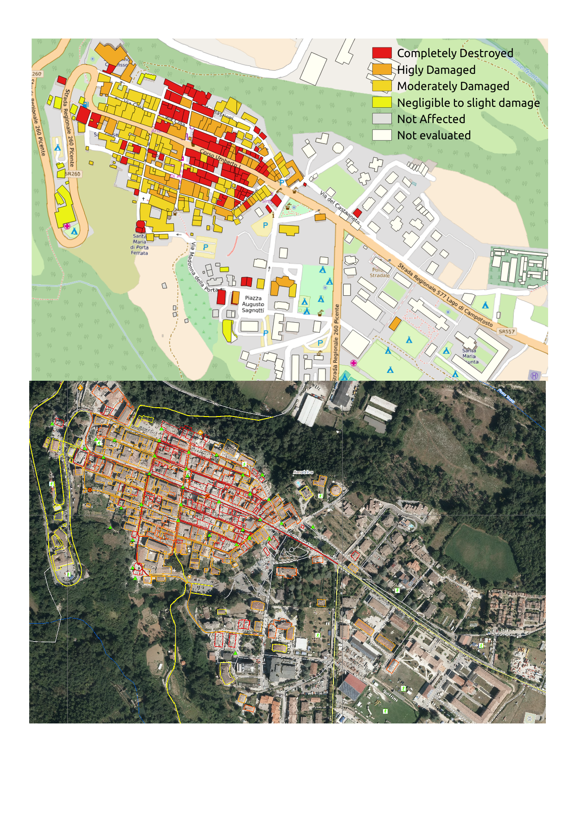

# Informazioni sull'elaborazione dei dati da Copernicus EMS

Il servizio Copernicus Emergency Management Service (© 2016 European Union) nella sezione [[EMRS177] Earthquake in Central Italy](http://emergency.copernicus.eu/EMSR177) fornisce dati vettoriali e immagini aeree interpretate sui danni a edifici e infrastrutture a causa del terremoto. I dati sono organizzati per _prodotti_, cioè separati in mappe relative a zone definite secondo una griglia di lavoro.

Attraverso l'analisi delle immagini aeree, insieme all'utilizzo di altri dati (tra i quali i dati degli edifici contenuti in [Openstreetmap](http://openstreetmap.org/)), Copernicus EMS ha effettuato una valutazione dei danni a edifici e altre inrastrutture secondo una classificaione di gravità:

* Completed Destroyed
* Highly Damaged
* Moderately Damaged
* Negligible to slight damage
* Not Affected

Tali informazioni sono distribuite attraverso dei file vettoriali in formato shapefile zippato e attraverso immagini (PDF, JGP, TIFF) georeferenziate.

## Dati vettoriali

Lo shapefile [settlements_merged](./shape_file) è stato derivato da [Alessandro Sarretta](https://twitter.com/alesarrett) dai dati pubblicati da Copernicus EMS. Lo scopo principale è di rendere disponibile aggregato e nel modo più aperto ed immediato possibile le informazioni relative alla valutazione del danno del terremoto, e di favorire l'inserimento di tali informazioni in Openstreetmap.

Con questa visione, e in conformità alla [policy di Copernicus EMS](http://emergency.copernicus.eu/mapping/ems/cite-copernicus-ems-mapping-portal), che dichiara che "_the information produced by the Copernicus Emergency Management Service shall be made available to the public on a full, open and free-of-charge basis_", i dati contenuti nello shapefile settlements_merged e tutti i suoi derivati (kml, geojson, ...) sono rilasciati con licenza [Creative Commons Attribution-ShareAlike 4.0 International](http://creativecommons.org/licenses/by-sa/4.0/) (CC-BY-SA).

In particolare, sono stati scaricati i dati vettoriali relativi alla valutazione del danno per le 26 mappe prodotte. Nel file [mapsList.csv](./mapsList.csv) si trovano elencati i nomi delle mappe con i link al download diretto del file zip contentente ciascuno shapefile.

I file contengono valutazioni dei danni per vari elementi, tra cui edifici, strade, ferrovie, e anche informazioni puntuali su crolli, strade interrotte e sulla localizzazione di campi di soccorso e tende. *Nel file settlements_merged sono inclusi solamente i dati relativi alla valutazione dei danni sugli edifici*.

I file vettoriali sono stati elaborati in [QGIS](http://qgis.org) e uniti in un singolo shapefile tramite il comando "Merge vector layers".

Sono stati creati 2 file di stile, uno per visualizzare i dati tematizzati in QGIS ([_settlements_merged.qml_]() e uno in formato standard OGC [Style Layer Descriptor](http://www.opengeospatial.org/standards/sld) ([_settlements_merged.sld_].

Tutti i file sono nel sistema di coordinate WGS 84 / UTM zone 33 N ([EPSG:32633](http://spatialreference.org/ref/epsg/32633/)), tranne due: _Accumoli Aerial: Grading Map_ e _Sant'Angelo Aerial: Grading Map_. Poiché davano dei problemi nell'operazione di merge e le valutazione sono incluse da altre mappe a scala minore, per ora non sono stati inclusi.

Infine, il file è stato reso disponibile da Openstreetmap Italia tramite sevizio standard WMS a [questo link](http://osmit3.wmflabs.org/cgi-bin/qgis_mapserv.fcgi?map=/srv/Copernicus/settlements_grading.qgs&SERVICE=WMS&REQUEST=GetCapabilities&VERSION=1.3), per poter essere utilizzato ad esempio in [questo task di mappatura di Openstreetmap](http://osmit-tm.wmflabs.org/project/15).

Nella figura qui sotto un'immagine di esempio con in alto la zona di Amatrice con sfondo Openstreetmap e sovrapposto il WMS con lo shapefile settlements_merged, in basso la stessa zona nella mappa di Copernicus EMS.

## Immagini aeree

Un lavoro simile al precedente è stato effettuato sulle immagini aeree presenti in Copernicus.

Sono stati scaricati i file TIFF a 300 dpi (vedi file [mapsList.csv](./mapsList.csv)) e sucessivamente clippati in QGIS usando come limiti il [file .kmz](http://emergency.copernicus.eu/mapping/sites/default/files/thumbnails/EMSR177-AEM-1472324659-r05-v1.kmz) di Copernicus che definisce l'area di analisi (vedi figura precedente); questo per escludere dall'immagine la legenda della mappa che ha utilità essenzialmente per la consultazione cartacea.

Da questi dati sono stati creati due servizi WMS:

* un servizio contenente tutte le immagini aeree più aggiornate prodotte (escluse quelli descritte al punto successivo): http://osmit3.wmflabs.org/cgi-bin/qgis_mapserv.fcgi?SERVICE=WMS&MAP=/srv/geotiff/geotiffs_merged.qgs&REQUEST=GetCapabilities
* un servizio contenente tutte le immagini aeree più aggiornate prodotte per i centri abitati, a risoluzione molto elevata: http://osmit3.wmflabs.org/cgi-bin/qgis_mapserv.fcgi?SERVICE=WMS&MAP=/srv/geotiff/geotiffs_aerial_merged.qgs&REQUEST=GetCapabilities.

Anche questi servizi sono ospitati nel server di Openstreetmap Italia e sono utilizzati in [questo task di mappatura di Openstreetmap](http://osmit-tm.wmflabs.org/project/15).

## Note

Il giorno 30 agosto 2016 Copernicus EMS ha aggiornato 4 mappe:
Ad es. oggi hanno aggiornato 4 mappe:

* [Capodacqua Aerial: Grading Map](http://emergency.copernicus.eu/mapping/ems-product-component/EMSR177_14CAPODACQUAAERIAL_GRADING_OVERVIEW/2)
* [Arquata del Tronto Aerial: Grading Map](http://emergency.copernicus.eu/mapping/ems-product-component/EMSR177_19ARQUATADELTRONTOAERIAL_GRADING_OVERVIEW/3)
* [Sant'Angelo Aerial: Grading Map](http://emergency.copernicus.eu/mapping/ems-product-component/EMSR177_26SANTANGELOAERIAL_GRADING_OVERVIEW/2)
* [Amatrice Aerial: Grading Map](http://emergency.copernicus.eu/mapping/ems-product-component/EMSR177_20AMATRICEAERIAL_GRADING_OVERVIEW/2)

Tali aggiornamenti non sono stati ancora inclusi nei prodotti e servizi descritti in questo documento.
